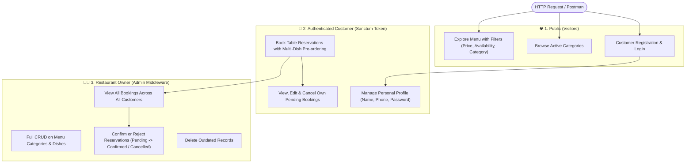
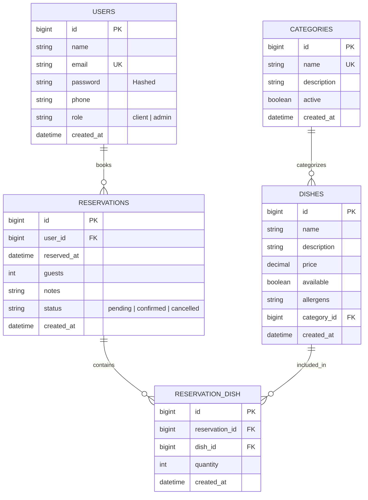
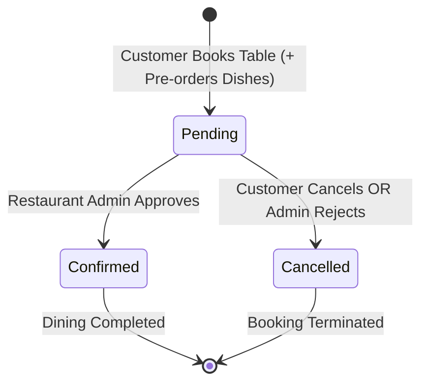

# 🍽️ Restaurant Management & Reservations API

<p align="center">
  
  
  
  
  
  
</p>

> An enterprise-grade, RESTful backend engine engineered with **Laravel 11**, **Eloquent ORM**, and **Laravel Sanctum**. Built for full-service hospitality operations, dynamic categorized menu curation, and complete table reservation lifecycles with Many-to-Many dish pre-ordering.

---

## ⚡ Multi-Tier Access Hierarchy



---

## 📊 Database Schema & Relations (ERD)



---

## 🔄 Table Reservation Lifecycle



---

## ✨ Key Architectural Highlights

* **Role-Based Access Control (RBAC):** Custom `is_admin` middleware isolates owner privileges from customer actions.
* **Many-to-Many Pivot Attributes:** The `reservation_dish` intermediate table tracks quantities (`quantity`) per pre-ordered dish using Eloquent's `withPivot`.
* **State Machine Protection:** Reservation editing and cancellation are restricted strictly to `pending` states.
* **Smart Menu Filtering:** Supports query parameters for instant catalog search:
  * `?category_id=1`
  * `?available=true`
  * `?max_price=20.00`
* **Defensive Input Validation:** Strict FormRequest validation ensuring booking dates are in the future (`after:now`) and guest counts fit table limits (`min:1|max:20`).
* **Automated Feature Test Suite:** Full suite covering registration, public menu browsing, reservation booking, and admin security guards.

---

## 📑 API Endpoints Reference

### 👤 Authentication & Profile

| Method | Endpoint | Access | Description | Payload Example |
| :--- | :--- | :--- | :--- | :--- |
| `POST` | `/api/register` | Public | Customer account registration | `{"name": "Maria", "email": "m@ex.com", "password": "pass", "password_confirmation": "pass"}` |
| `POST` | `/api/login` | Public | Authenticate and issue Sanctum token | `{"email": "m@ex.com", "password": "pass"}` |
| `GET` | `/api/me` | 🔒 **Customer / Admin** | Retrieve authenticated user profile | _None_ |
| `PUT` | `/api/me` | 🔒 **Customer / Admin** | Update profile info or password | `{"phone": "961234567"}` |
| `POST` | `/api/logout` | 🔒 **Customer / Admin** | Revoke current access token | _None_ |

### 🍽️ Menu & Categories

| Method | Endpoint | Access | Description | Payload Example |
| :--- | :--- | :--- | :--- | :--- |
| `GET` | `/api/categories` | Public | List active categories with dish counts | _None_ |
| `GET` | `/api/categories/{id}` | Public | Category details with available dishes | _None_ |
| `POST` | `/api/categories` | 👨‍🍳 **Admin Only** | Create new category | `{"name": "Desserts", "active": true}` |
| `PUT` | `/api/categories/{id}` | 👨‍🍳 **Admin Only** | Update category | `{"name": "Delicacies"}` |
| `DELETE` | `/api/categories/{id}` | 👨‍🍳 **Admin Only** | Delete category | _None_ |
| `GET` | `/api/dishes` | Public | Query dishes (`?category_id=1&max_price=15`) | _None_ |
| `GET` | `/api/dishes/{id}` | Public | Retrieve single dish details | _None_ |
| `POST` | `/api/dishes` | 👨‍🍳 **Admin Only** | Add dish to menu | `{"name": "Bacalhau", "price": 18.5, "category_id": 1}` |
| `PUT` | `/api/dishes/{id}` | 👨‍🍳 **Admin Only** | Update dish info | `{"price": 19.0}` |
| `DELETE` | `/api/dishes/{id}` | 👨‍🍳 **Admin Only** | Remove dish from menu | _None_ |

### 📅 Reservations

| Method | Endpoint | Access | Description | Payload Example |
| :--- | :--- | :--- | :--- | :--- |
| `GET` | `/api/reservations` | 🔒 **Customer / Admin** | Customer sees own; Admin sees all (`?status=pending`) | _None_ |
| `GET` | `/api/reservations/{id}` | 🔒 **Owner / Admin** | View reservation details with dishes | _None_ |
| `POST` | `/api/reservations` | 🔒 **Customer** | Book table with optional dishes | `{"reserved_at": "2026-10-15 20:00:00", "guests": 4, "dishes": [{"id": 1, "quantity": 2}]}` |
| `PUT` | `/api/reservations/{id}` | 🔒 **Owner (Pending)** | Modify pending reservation | `{"guests": 3}` |
| `PATCH` | `/api/reservations/{id}/cancel` | 🔒 **Owner (Pending)** | Customer cancels booking | _None_ |
| `PATCH` | `/api/reservations/{id}/status` | 👨‍🍳 **Admin Only** | Confirm or reject reservation | `{"status": "confirmed"}` |
| `DELETE` | `/api/reservations/{id}` | 👨‍🍳 **Admin Only** | Purge reservation record | _None_ |

---

## 🔑 Pre-Configured Test Accounts (Seeders)

| Role | Email | Password | Privileges |
| :--- | :--- | :--- | :--- |
| **Restaurant Owner (Admin)** | `admin@restaurante.pt` | `password123` | Full access to menu CRUD, all reservations, and status transitions |
| **Customer** | `maria@email.com` | `password123` | Can book reservations, view personal history, and update profile |

---

## 🛠️ Quickstart & Local Setup

### 1. Prerequisites
* **PHP 8.3+** with SQLite extension
* **Composer**

### 2. Clone the Repository
```bash
git clone https://github.com/Afonsojlc/restaurant-api.git
cd restaurant-api
```

### 3. Install Dependencies
```bash
composer install
```

### 4. Configure Environment
```bash
cp .env.example .env
php artisan key:generate
```
Ensure your `.env` contains:
```env
DB_CONNECTION=sqlite
```

### 5. Initialize & Seed SQLite Database
```bash
touch database/database.sqlite
php artisan migrate:fresh --seed
```

### 6. Run the Application
```bash
php artisan serve
```
The API is available at: `http://127.0.0.1:8000/api`

---

## 🧪 Running Automated Tests

Run the feature test suite:
```bash
php artisan test
```

---

## 📬 Postman Suite Testing

The repository provides a complete, plug-and-play Postman suite:
* [`restaurant-api.postman_collection.json`](restaurant-api.postman_collection.json)
* [`restaurant-api.postman_environment.json`](restaurant-api.postman_environment.json)

### Instructions:
1. Open **Postman** and import both files.
2. Select the **Restaurant API** environment.
3. Run the **`Login`** request with either admin or customer credentials.
4. The Bearer token is automatically set into `{{token}}` for all subsequent requests.

---

## 📁 Repository Structure

```text
restaurant-api/
├── app/
│   ├── Http/
│   │   ├── Controllers/          # Auth, Category, Dish, Reservation controllers
│   │   └── Middleware/           # IsAdmin role guard
│   └── Models/                   # Eloquent models (User, Category, Dish, Reservation)
├── database/
│   ├── migrations/               # Schema definitions (including pivot table)
│   └── seeders/                  # Initial data (admin, client, dishes, reservations)
├── docs/
│   └── ficha_restaurante_api.pdf # Project requirements & assignment archive
├── routes/
│   └── api.php                   # Public, Authenticated, and Admin routes
├── tests/
│   └── Feature/
│       └── RestaurantApiTest.php # Automated feature tests
├── restaurant-api.postman_collection.json  # Postman test collection
├── restaurant-api.postman_environment.json # Postman environment
├── composer.json                 # Project dependencies
└── README.md                     # Comprehensive documentation
```

---

## 👤 Author

**Afonso Carvalho**
* GitHub: [@Afonsojlc](https://github.com/Afonsojlc)
* LinkedIn: [Afonso Carvalho](https://www.linkedin.com/in/afonso-carvalho-64796328a/)

---

## 📄 License

This project is licensed under the [MIT License](LICENSE).
